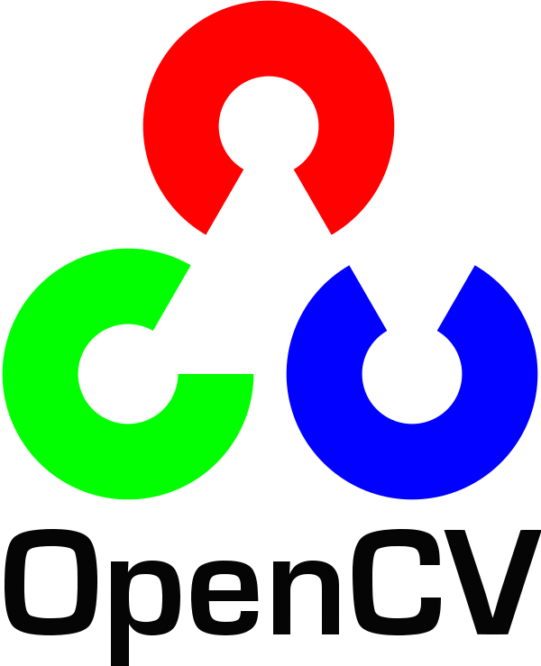

# aki-ph-chem

## whoami

- ???(missing now ...)

## Interests

- molecular⚛️  spectroscopy (high-resolution⚡️,rotation, large amprituede motion )
- numerical calculation💻
- low rayer technology(computer architecture🧮, Linux system programming🐧)
- CLI ⌨ (NeoVim✒️, Shell🐚)
- statically typed language (C++, Rust 🦀)

## SNS

| service                                 | icon                                                                                                                 |
|-----------------------------------------|----------------------------------------------------------------------------------------------------------------------|
| [X.com](https://x.com/aaki36011407)     |  |
| [keybase](https://keybase.io/a4ki)      |                                      |
| [Hatena](https://a44ki.hatenablog.com/) |                                      |
| [GitLab](https://gitlab.com/_aki_)      |                                                                                                                      |

## Home Page

[aki.blog](https://akiblog.org/)

## Languages and Tools

| tool   | icon                                                                                                                                                 |
|--------|------------------------------------------------------------------------------------------------------------------------------------------------------|
| C      |                          |
| C++    |  |
| Rust   |                                              |
| Python |           |
| Lua    |                                        |
| Gtk    |                                        |
| Git    |                                              |
| Linux  |              |
| Nix    |                              |

## Currently studying new

| tool       | icon                                                                                                         |
|------------|--------------------------------------------------------------------------------------------------------------|
| OpenCL     |  |
| SYCL       |       |
| CUDA       |                                                        |
| OpenCV     |                                             |
| libvirt    |                           |
| Cloudflare |                               |
| TypeScript |                                   |

## Status

